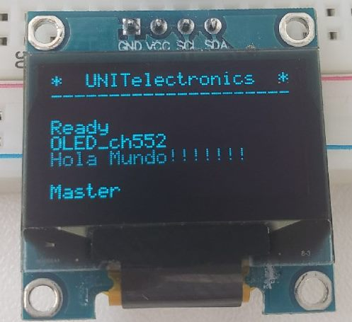

# Configuración  OLED I2C SSD1306
En la convergencia de la innovación tecnológica y la creatividad visual, la configuración de pantallas OLED adquiere un papel central. En este contexto, el presente texto se adentra en el proceso de configuración de un modelo específico: la pantalla OLED SSD1306. Con el propósito de lograr una comunicación fluida y eficiente, se recurre a la utilización del protocolo I2C y al entorno de programación Arduino IDE. Este repositorio explora los pasos esenciales para llevar a cabo dicha configuración, haciendo hincapié en la obtención del archivo 'oled_hola_mundo', la adaptación precisa de los parámetros de datos en sintonía con el entorno ch55xduino y la consecuente posibilidad de presentar mensajes de manera efectiva en la pantalla. Adentrémonos en esta travesía de integración tecnológica y expresión visual.
# Configurando el entorno! 👋
Para configurar nuestra pantalla OLED, hacemos uso del Arduino IDE para cargar los archivos.
Por lo que para poder iniciar con nuestro despliesgue se necesita:


1. Descargar el archivo oled_hola_mundo.
1. Dentro de la carpeta encontrarás un archivo que lleva por nombre "oled_hola_mundo.ino" abre el archivo con Arduino IDE.
1. Para poder cargar el archivo configura el entorno con las siguiente especificaciones:

    * `Reloj`: *16 Mhz.*
    * `Método de carga`: *USB.*
    * `Ajuste de carga a: ` *"USER CODE /w 2866 USB RAM"*

4. Para completar la carga del codigo, presiona el boton de boot mientras se conecta via USB. 
5. Carga el codigo. 


## Proyecto en funcionamiento




## 🛠️ Abre y ejecuta el proyecto

La configuración de la conexión, se encuentra asignada en el archivo de la ruta `scr/config.h`

```
// Pin definitions
#define PIN_BUZZER          P33       // buzzer pin
#define PIN_SDA             P32       // I2C SDA
#define PIN_SCL             P31       // I2C SCL
```


## Conexión 

