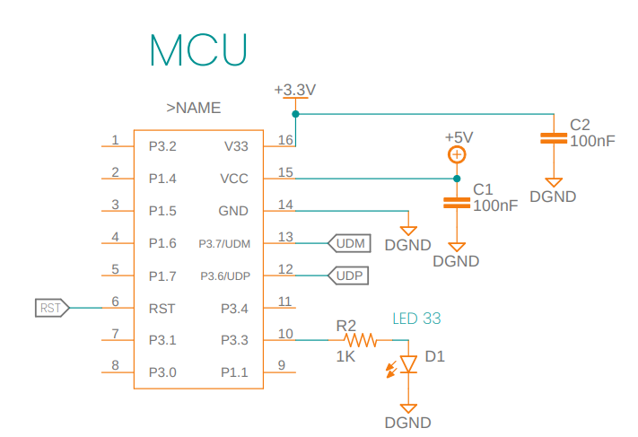
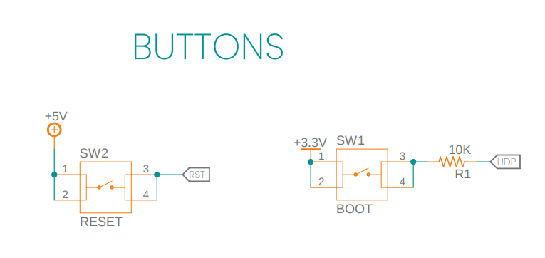
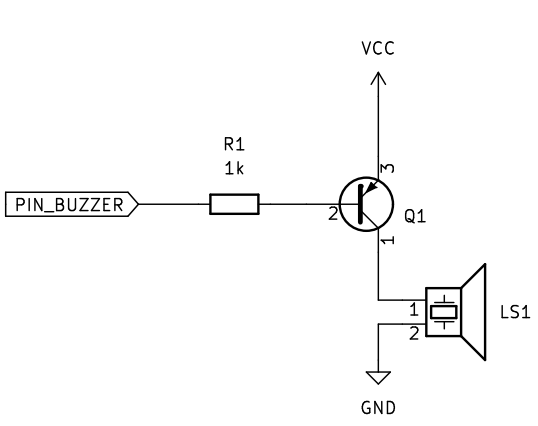

# Configuración  OLED I2C SSD1306
En la intersección de la innovación tecnológica y la creatividad visual, las pantallas OLED desempeñan un papel central. Este repositorio se enfoca en el proceso de configuración de un modelo específico: la pantalla OLED SSD1306. Hemos adaptado el código original de [Stefan Wagner](https://github.com/wagiminator) con el objetivo de lograr una comunicación eficiente y fluida en el chip ch552. Para lograrlo, utilizamos el protocolo I2C y el entorno de programación Arduino IDE.

Exploraremos los pasos fundamentales para realizar esta configuración, haciendo especial hincapié en la obtención del archivo 'oled_hola_mundo', la precisa adaptación de los parámetros de datos en armonía con el entorno ch55xduino y la consecuente capacidad de presentar mensajes de manera efectiva en la pantalla. Acompáñanos en esta travesía de integración tecnológica y expresión visual."

Conexión básica de funcionamiento CH552  


# Configurando el entorno! 👋
Para configurar nuestra pantalla OLED, hacemos uso del Arduino IDE para cargar los archivos.
Por lo que para poder iniciar con nuestro despliesgue se necesita:


1. Descargar el archivo oled_hola_mundo.
1. Dentro de la carpeta encontrarás un archivo que lleva por nombre "oled_hola_mundo.ino" abre el archivo con Arduino IDE.
1. Para poder cargar el archivo configura el entorno con las siguiente especificaciones:

    * `Reloj`: *16 Mhz.*
    * `Método de carga`: *USB.*
    * `Ajuste de carga a: ` *"USER CODE /w 2866 USB RAM"*

1. Para completar la carga del codigo, presiona el boton de boot mientras se conecta via USB. 


>


## 🛠️ Abre y ejecuta el proyecto

La configuración de la conexión, se encuentra asignada en el archivo de la ruta `scr/config.h`

```
// Pin definitions
#define PIN_BUZZER          P33       // buzzer pin
#define PIN_SDA             P32       // I2C SDA
#define PIN_SCL             P31       // I2C SCL
```

> [!NOTE]
> El PIN BUZZER o de LED nos permite saber que la transmisión de los datos se ejecutó correctamente. Como se menciona no es necesaria su conexión a menos que se desee ocupar como alerta.
> 



## Conexión 
```
// Conexión CH552 a LED:
// -------                                 CH552
//                                       +--\/--+
//     OLED (SDA) ---------------- P32  1|°     |16  V33 -------------
//                ---------------- P14  2|      |15  Vcc -------------
//                ---------------- P15  3|      |14  GND -------------
//                ---------------- P16  4|      |13  P37 UDM --- USB D-
//                ---------------- P17  5|      |12  P36 UDP --- USB D+
//                ---------------- RST  6|      |11  P34 -------------
//     OLED (SCL) ---------------- P31  7|      |10  P33 BUZZER or LED
//                ---------------- P30  8|      |9   P11 -------------
//                                       +------+
//                                          
//                                        OLED I2C SSD1306
//                                       +---------------+
//                                       | +---------+   |
//                                       | |         |   |
//                ----------- (SDA) -----| |         |   |
//                ----------- (SCL) -----| |         |   |
//                ------------ VCC  -----| |         |   |
//                ------------ GND  -----| |         |   |
//                                       | |         |   |
//                                       | +---------+   |
//                                       +---------------+
```


## Proyecto en funcionamiento


# Proyecto original

Para acceder a información detallada sobre el proyecto mencionado, te invitamos a consultar el repositorio específico del autor:

* [CH552-USB-OLED](https://github.com/wagiminator/CH552-USB-OLED/tree/main)